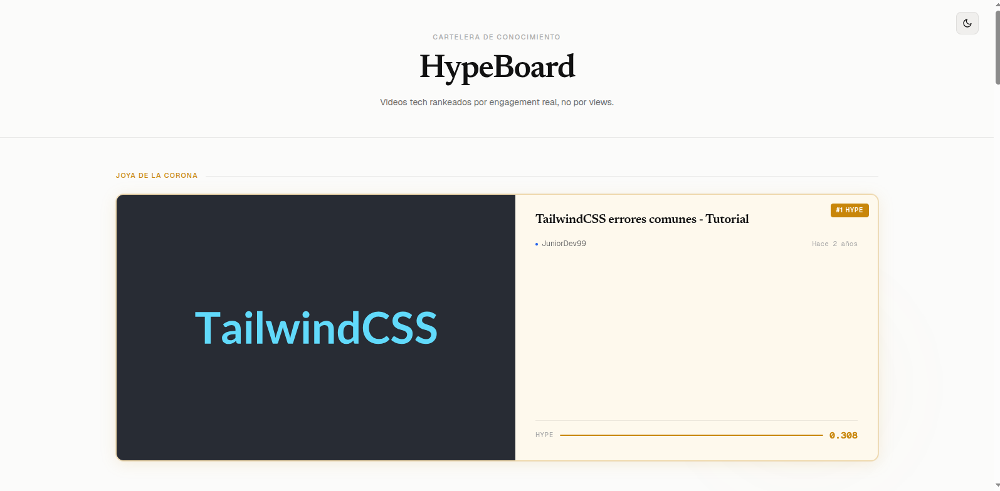
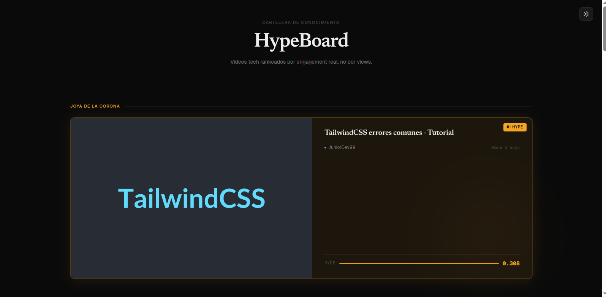
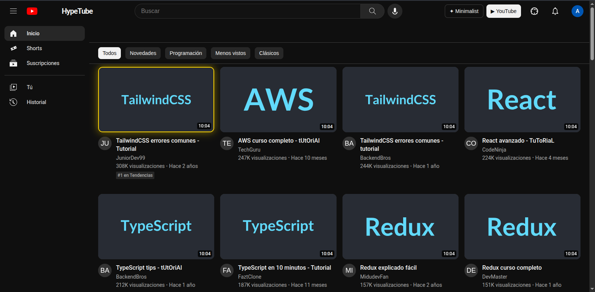

# HypeBoard — Cartelera de Conocimiento

[](https://github.com/Yondayler/Technical-Test-NestJS-React/actions/workflows/ci.yml)

Una aplicación full-stack que procesa un mock de la API de YouTube y presenta los videos en una cartelera visual rankeada por **Nivel de Hype** — una métrica de engagement calculada a partir de likes, comentarios y vistas.

## Preview

| Tema Minimalist (Dark) | Tema Minimalist (Light) | Tema YouTube |
|:---:|:---:|:---:|
|  |  |  |

## ✨ Características Principales

* **Arquitectura Estructural Multi-Tema**: Más allá de simples cambios CSS, el proyecto implementa un *Theme Router* en React capaz de reemplazar el DOM y los componentes visuales completos en tiempo real.
    * **Minimalist**: Diseño original centrado en tipografías editoriales, alto contraste y animaciones GSAP, donde la "Joya de la Corona" es una tarjeta masiva de ancho completo.
    * **YouTube**: Una réplica estructural pixel-perfect, con barra lateral, menú superior, filtros mediante chips funcionales y animaciones en cascada.
    * **Netflix Original**: Una experiencia cinemática inmersiva con un "Gran Estreno" (Hero Billboard), barra de navegación dinámica, buscador integrado, y carruseles con efecto hover idénticos a la plataforma de streaming.
    * **Cyberpunk**: Un estilo vibrante y futurista que soporta modo claro (Vaporwave) y oscuro (Neon Dark), demostrando el dominio avanzado de variables CSS.
* **Manejo de Estado y Rendimiento**: Implementación de Hooks personalizados (`useVideos`, `useDebounce`) para un filtrado y ordenamiento óptimo en el backend, limitando solicitudes de red.
* **Modo Claro/Oscuro Real**: Integración impecable de *CSS Variables* gestionadas por localStorage para retener preferencias.
* **Documentación Automática**: Backend documentado usando Swagger/OpenAPI.
* **Despliegue Universal**: Todo Dockerizado en una arquitectura multi-contenedor para iniciar con un simple comando de Make.

## Tecnologías

| Capa | Stack |
|---|---|
| Backend | NestJS · TypeScript · Node.js |
| Frontend | React 19 · TypeScript · Vite |
| Tests | Jest · NestJS Testing Module |

---

## Estructura del proyecto

```
app/
├── backend/               # API NestJS
│   ├── src/
│   │   └── videos/        # Feature module
│   │       ├── dto/
│   │       ├── interfaces/
│   │       ├── videos.controller.ts
│   │       ├── videos.service.ts
│   │       └── videos.service.spec.ts
│   └── mock-youtube-api.json
├── frontend/              # App React + Vite
│   └── src/
│       ├── components/
│       ├── hooks/
│       └── types/
└── mock-youtube-api.json  # Datos de prueba originales
```

---

## Requisitos previos

### Para correr con Docker (Recomendado)
- **Docker** v20 o superior
- **Docker Compose** v2 o superior (viene incluido con Docker Desktop)
- **make**

Verifica tu instalación:
```bash
docker --version
docker compose version
make --version
```

### Para ejecución manual
- **Node.js** v18 o superior
- **npm** v9 o superior

---

## Instalación y ejecución

### ⭐ Opción A: Docker con Make (Recomendado)

La forma más sencilla y rápida de levantar todo el stack:

```bash
# 1. Clonar el repositorio
git clone https://github.com/Yondayler/Technical-Test-NestJS-React.git

cd Technical-Test-NestJS-React

# 2. Construir las imágenes (solo la primera vez o tras cambios)
make build

# 3. Levantar la aplicación
make up
```

Al terminar verás (en Linux):
```bash
╔══════════════════════════════════════════════╗
║        ✅  HypeBoard está listo!             ║
╠══════════════════════════════════════════════╣
║  🌐 Frontend  →  http://localhost:5173       ║
║  ⚙️  Backend   →  http://localhost:3001       ║
╚══════════════════════════════════════════════╝
```

Al terminar verás (en Windows):
```bash
------------------------------------------------
         HypeBoard esta listo!
------------------------------------------------
   Frontend  ->  http://localhost:5173
   Backend   ->  http://localhost:3001
------------------------------------------------
```

#### Comandos disponibles

| Comando | Descripción |
|---|---|
| `make build` | Construye (o reconstruye) las imágenes desde cero |
| `make up` | Levanta los contenedores en segundo plano |
| `make down` | Apaga y elimina los contenedores |
| `make logs` | Muestra los logs en tiempo real |
| `make clean` | Elimina contenedores, volúmenes e imágenes huérfanas |

### ⭐ Opción B: Docker Directo (Sin Make)

Si no tienes instalado `make` (común en Windows), puedes usar los comandos de Docker directamente:

```bash
# 1. Construir las imágenes
docker compose build --no-cache

# 2. Levantar la aplicación
docker compose up -d
```

> **Nota:** Al usar esta opción, el cuadro de colores informativo **no aparecerá automáticamente** en la terminal. 

Para confirmar que todo funciona, asegúrate de ver estos mensajes en tu terminal:
- `✔ Container hypeboard_backend  Healthy`
- `✔ Container hypeboard_frontend Started`

Si los ves, el sistema ya está listo en:
- **Frontend:** [http://localhost:5173](http://localhost:5173)
- **Backend:** [http://localhost:3001](http://localhost:3001)

#### Otros comandos útiles (Equivalentes a Make):
| Acción | Comando Docker Directo |
|---|---|
| **Apagar todo** (`make down`) | `docker compose down` |
| **Ver logs** (`make logs`) | `docker compose logs -f` |
| **Limpiar todo** (`make clean`) | `docker compose down -v --remove-orphans` |

---

### Opción C: Ejecución Manual

#### 1. Clonar el repositorio

```bash
git clone https://github.com/Yondayler/Technical-Test-NestJS-React.git

cd Technical-Test-NestJS-React
```

#### 2. Backend (NestJS)

```bash
cd app/backend
npm install
npm run start:dev
```

El servidor arranca en **`http://localhost:3001`**

Endpoints disponibles:
```
GET  http://localhost:3001/api/videos        → Lista de videos con Hype
GET  http://localhost:3001/api/videos?sort=date-desc&search=react
GET  http://localhost:3001/api/docs          → Documentación Swagger / OpenAPI
```

#### 3. Frontend (React + Vite)

En una terminal separada:

```bash
cd app/frontend
npm install
npm run dev
```

La aplicación se abre en **`http://localhost:5173`**

> **Importante:** El backend debe estar corriendo antes de abrir el frontend.

---

## Ejecutar tests

### Tests unitarios + cobertura

```bash
cd app/backend
npm test           # unit tests
npm run test:cov   # con reporte de cobertura
```

Salida esperada:
```
PASS  src/videos/videos.controller.spec.ts
PASS  src/videos/videos.service.spec.ts
  VideosService
    calculateHype()
      ✓ debería calcular el hype base correctamente
      ✓ debería multiplicar x2 cuando el título contiene "Tutorial" (mayúsculas)
      ✓ debería multiplicar x2 cuando el título contiene "tutorial" (minúsculas)
      ✓ debería multiplicar x2 cuando el título contiene "TuToRiaL" (mixed case)
      ✓ debería retornar 0 cuando los comentarios están desactivados
      ✓ debería retornar 0 cuando viewCount es 0 (evitar división por cero)
      ✓ debería retornar 0 cuando comentarios desactivados aunque el título diga "Tutorial"
      ✓ debería procesar correctamente los valores tipo string del JSON
    getRelativeTime()
      ✓ debería retornar "Hace unos segundos" para fechas muy recientes
      ✓ debería retornar "Hace 1 minuto" para 90 segundos atrás
      ✓ debería retornar "Hace X minutos" para varios minutos atrás
      ✓ debería retornar "Hace 1 día" para 25 horas atrás
      ✓ debería retornar "Hace X días" para varios días atrás
      ✓ debería retornar "Hace 1 mes" para ~31 días atrás
      ✓ debería retornar "Hace X meses" para varios meses atrás
      ✓ debería retornar "Hace 1 año" para ~366 días atrás
      ✓ debería retornar "Hace X años" para varios años atrás
  VideosController
    findAll()
      ✓ debería llamar al service con la query recibida y retornar su resultado
      ✓ debería pasar el parámetro sort al service sin modificarlo
      ✓ debería pasar el parámetro search al service sin modificarlo
      ✓ debería pasar sort y search combinados al service
      ✓ debería retornar array vacío si el service no encuentra resultados
      ✓ el controller es una capa delgada: devuelve exactamente lo que el service retorna

Tests: 23 passed, 23 total
```

### Tests E2E (integración HTTP completa)

```bash
cd app/backend
npm run test:e2e
```

Salida esperada:
```
PASS  test/app.e2e-spec.ts
  Videos API (e2e)
    GET /api/videos
      ✓ debería retornar 200 y un array de videos
      ✓ debería retornar videos con el contrato de VideoResponseDto
      ✓ NO debería exponer publishedAtISO (campo @Excluded del DTO)
      ✓ debería ordenar por hype descendente por defecto
      ✓ debería ordenar por hype ascendente con sort=hype-asc
      ✓ debería filtrar por título con el parámetro search
      ✓ debería retornar array vacío cuando la búsqueda no tiene resultados
      ✓ debería admitir combinación de sort y search simultáneamente
      ✓ debería retornar 400 cuando sort tiene un valor no permitido

Tests: 9 passed, 9 total
```

---

## Respuesta del endpoint

```json
[
  {
    "id": "vid_003",
    "thumbnail": "https://via.placeholder.com/300x200/4A90D9/FFFFFF?text=TailwindCSS",
    "title": "TailwindCSS errores comunes - Tutorial",
    "author": "JuniorDev99",
    "publishedAt": "Hace 2 años",
    "hypeLevel": 0.308
  }
]
```

> **Nota:** El campo `thumbnail` refleja la URL original del mock de YouTube. El frontend intercepta esta URL y reemplaza el dominio `via.placeholder.com` (dado de baja) por `placehold.co` en el componente `Thumbnail` antes de pasársela al ``, sin modificar la respuesta del servidor.


---

## Funcionalidades destacadas

- **Joya de la Corona** — El video con mayor Hype se muestra en una card destacada con diseño especial
- **Dark / Light Mode** — Toggle persistente que respeta `prefers-color-scheme` del sistema
- **Estados de UI** — Skeleton loading, error con retry y estado vacío
- **Cálculo de Hype** — Fórmula con reglas de negocio: multiplicador x2 para tutoriales, Hype 0 si comentarios desactivados, protección contra división por cero
- **Fechas sin librerías externas** — Transformación a texto relativo implementada con JS nativo
- **Swagger / OpenAPI** — Documentación interactiva disponible en `http://localhost:3001/api/docs`
- **Búsqueda y ordenamiento backend-driven** — 5 criterios de sort + búsqueda por título con debounce en el frontend
